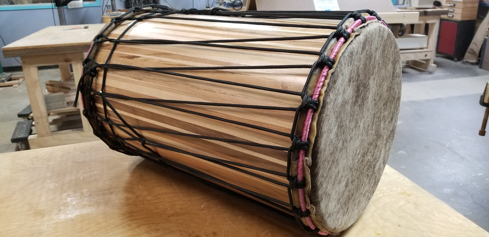

# Dundun — Engineering Documentation for the West African Bass Drum Family

> *Stave-built dunduns — the dual-headed cylindrical bass drums that anchor the West African djembe ensemble. Built at Morgan Drums (St. Paul, MN) and revisited as an ongoing engineering project.*


*(placeholder — drop in a finished-instrument photo or the trio of three sizes)*

## What this is

Engineering documentation for the **stave-built dundun family** — a set of three cylindrical, dual-headed bass drums (kenkeni, sangban, and doundounba) that provide rhythmic foundation and melodic counterpoint to the djembe in traditional West African ensemble music.

This repository combines:

1. **CAD geometry** for the three dundun sizes — their cylinder dimensions, head diameters, and internal volumes.
2. **Cowhide head construction** notes — the heavier, lower-pitched cousin of the goatskin head used on djembes and ashikos.
3. **Tuning math** relating cylinder dimensions to the ensemble pitch relationships between kenkeni, sangban, and doundounba.

Sister project to [`djembe`](https://github.com/tonykoop/djembe), [`didgeridoo`](https://github.com/tonykoop/didgeridoo), and [`ashiko-drum-workshop`](https://github.com/tonykoop/ashiko-drum-workshop).

## Background

The **dundun family** (also doundoun, dunun) is a set of three cylindrical wooden drums originating with the **Mande peoples of West Africa** — Mali, Guinea, Burkina Faso, Senegal, Côte d'Ivoire — the same cultural region that gave the world the djembe. Where the djembe carries the high, articulate voice in an ensemble, the dunduns carry the bass voice. Each is dual-headed: a cowhide skin stretched across both ends of the cylinder, lashed together with vertical rope tension so that tightening one head also tightens the other.

The three voices, smallest to largest:

- **Kenkeni** — the smallest, highest-pitched dundun. ~12–14" diameter, ~18" tall. Plays the timekeeping pulse.
- **Sangban** — the middle voice. ~14–16" diameter, ~22" tall. Plays the harmonic lead.
- **Doundounba** — the largest and deepest. ~16–18" diameter, ~28" tall. Plays the bass anchor.

Played with a stick on the head and (often) a bell mounted on the side, the trio provides the harmonic and rhythmic spine that the djembe solos over.

I built dunduns at **Morgan Drums** in St. Paul, MN — the same shop where I built [my stave-built djembes](https://github.com/tonykoop/djembe) — using the same stave-and-rope construction methodology adapted to the cylindrical geometry.

## The engineering challenge

Compared to the djembe (variable goblet profile, varying compound miter angle along stave height) and the didgeridoo (long bore with target acoustic length), the dundun is **the simplest geometry of the three** — a closed cylinder with a single constant compound miter angle, identical at every position along the stave height.

This makes the dundun a cleaner *fabrication* problem and a more interesting *acoustic* problem:

- **Fabrication is a stave count + diameter problem only.** Pick the number of staves `n`, pick the target inner diameter `D`, calculate stave width `w = π D / n` and bevel angle `θ = 180°/n`. Cut, glue, head, rope. Same compound angle on every stave from end to end.
- **Acoustics is a tuning problem.** A dundun's pitch comes from the interaction of three things: the cylinder's natural air-column resonance (set by its length and diameter), the cowhide head's tensioned-membrane modes, and the dual-head coupling through the air enclosed in the cylinder. Tightening the rope changes the head tension, which changes the pitch — but only within the band the cylinder's geometry will support. Designing a kenkeni / sangban / doundounba *trio* that sits at a useful musical pitch ratio means picking cylinder dimensions that reinforce the desired tuning.

## CAD and design work

> *(Forthcoming.)*

Repository structure is laid out for:

- `/CAD/dundun-bodies/` — the three target cylinder geometries (kenkeni / sangban / doundounba), parametric in stave count.
- `/CAD/stave/` — single-stave geometry, scaled to each size.
- `/CAD/heads/` — cowhide head specifications and the iron tensioning rings (top and bottom rings + connecting rope path).
- `/CAD/jigs/` — the cutting jig (much simpler than the djembe equivalent — just a constant-angle compound miter sled, like the ashiko one but adapted for the larger stave widths).

## Acoustic notes

> *(Forthcoming — pulling tuning measurements and any frequency analysis from personal archives.)*

The dundun trio's pitch relationships in traditional Mande ensembles are not standardized in equal-temperament terms, but the rough relationship is: **kenkeni about a perfect fourth above sangban, sangban about a perfect fourth above doundounba.** Building to that interval requires choosing the three cylinder geometries thoughtfully.

## Build history

I built dunduns at Morgan Drums during my 2008+ tenure there. Hero photos and detail shots of those instruments are forthcoming as I locate them in personal archives.

## What this work is for

- **The simpler-geometry, harder-acoustics question** — the dundun is the inverse of the djembe. Easy to build, harder to *tune*. This repository is where that tuning problem gets formalized.
- **The ensemble question** — designing a kenkeni/sangban/doundounba set that plays musically together as a trio, not just three individual drums.
- **The portfolio frame** — completes the trio of West-African-tradition-rooted stave-built drum repositories (djembe, ashiko, dundun) on my GitHub. Together they document a coherent body of craft and engineering practice across more than a decade.

## License

Released under [CC-BY 4.0](LICENSE) — use freely with attribution. The dundun originates with Mande West African cultures with deep continuous tradition; the stave-construction methodology, CAD work, and tuning analysis in this repository are my own work, free to reuse and adapt with credit.

## Repository structure

```
dundun/
├── README.md                  ← you are here
├── LICENSE                    ← CC-BY 4.0
├── .gitignore
├── analysis/                  ← tuning math, ensemble pitch ratios
├── CAD/
│   ├── dundun-bodies/         ← kenkeni / sangban / doundounba geometries
│   ├── stave/                 ← single-stave geometry per size
│   ├── heads/                 ← cowhide head + iron ring + rope path
│   └── jigs/                  ← compound miter sled (constant angle)
├── drawings/                  ← PDF exports
├── images/                    ← finished-build photos + figures
└── reference/                 ← Mande ensemble notes, tuning references
```

## Status

| Section | Status |
|---|---|
| Repo description, license, gitignore | ✓ done |
| Hero photos | forthcoming |
| CAD — body geometry per size | not started |
| CAD — stave geometry | not started |
| CAD — head + ring + rope path | not started |
| CAD — jig design | not started |
| Acoustic tuning analysis | not started |
| Physical builds documented | searching personal archives |

A repository in motion, not a finished portfolio piece.
