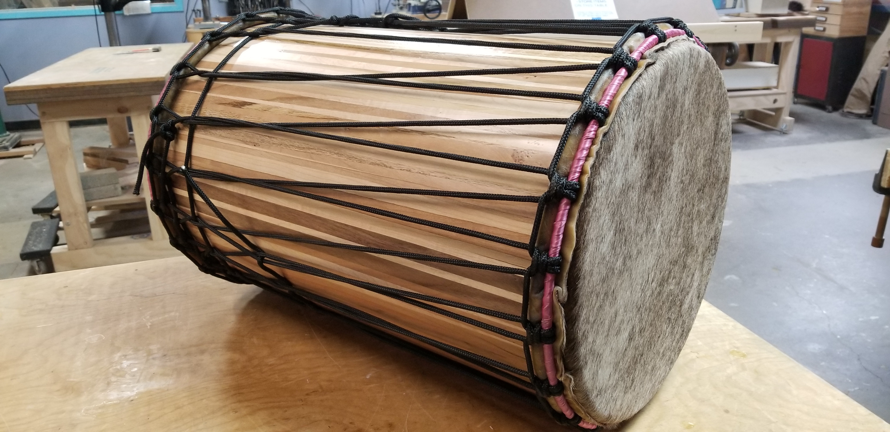
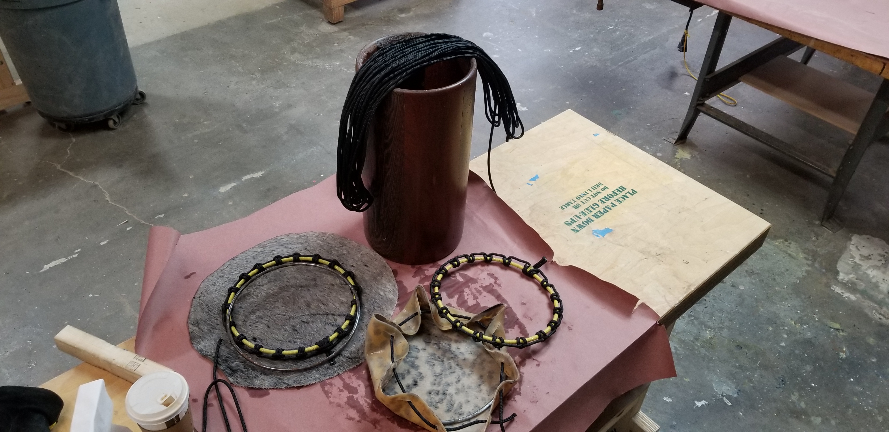

# Dundun — Engineering Documentation for the West African Bass Drum Family

Status: L2 V5 build-packet candidate — trio packet expanded in round 1 2026-05-29: `reference/cultural-provenance.md` added (Mande origin, Morgan Drums context, build assumptions separated from cultural notes); `validation-loop.csv` expanded with pitch interval, strike response, and ensemble listen checks (VAL-016–VAL-020).

> *Stave-built dunduns — the dual-headed cylindrical bass drums that anchor the West African djembe ensemble. Built at Morgan Drums (St. Paul, MN) and revisited as an ongoing engineering project.*


*Close-up of a finished stave-built dundun body: vertical wood staves, rope tuning, skin head, and hoop detail. The cylindrical geometry is simpler than a djembe, but the rope path, head seating, and shell stiffness still decide the final sound.*

## What this is

Engineering documentation for the **stave-built dundun family** — a set of three cylindrical, dual-headed bass drums (kenkeni, sangban, and doundounba) that provide rhythmic foundation and melodic counterpoint to the djembe in traditional West African ensemble music.

This repository combines:

1. **CAD geometry** for the three dundun sizes — their cylinder dimensions, head diameters, and internal volumes.
2. **Cowhide head construction** notes — the heavier, lower-pitched cousin of the goatskin head used on djembes and ashikos.
3. **Tuning math** relating cylinder dimensions to the ensemble pitch relationships between kenkeni, sangban, and doundounba.

Sister project to [`djembe`](https://github.com/tonykoop/djembe), [`didgeridoo`](https://github.com/tonykoop/didgeridoo), and [`ashiko-drum-workshop`](https://github.com/tonykoop/ashiko-drum-workshop).

## Background

The **dundun family** (also doundoun, dunun) is a set of three cylindrical wooden drums originating with the **Mande peoples of West Africa** — Mali, Guinea, Burkina Faso, Senegal, Côte d'Ivoire — the same cultural region that gave the world the djembe. Where the djembe carries the high, articulate voice in an ensemble, the dunduns carry the bass voice. Each is dual-headed: a cowhide skin stretched across both ends of the cylinder, lashed together with vertical rope tension so that tightening one head also tightens the other.

The three voices, smallest to largest:

- **Kenkeni** — the smallest, highest-pitched dundun. ~12–14" diameter, ~18" tall. Plays the timekeeping pulse.
- **Sangban** — the middle voice. ~14–16" diameter, ~22" tall. Plays the harmonic lead.
- **Doundounba** — the largest and deepest. ~16–18" diameter, ~28" tall. Plays the bass anchor.

Played with a stick on the head and (often) a bell mounted on the side, the trio provides the harmonic and rhythmic spine that the djembe solos over.

I built dunduns at **Morgan Drums** in St. Paul, MN — the same shop where I built [my stave-built djembes](https://github.com/tonykoop/djembe) — using the same stave-and-rope construction methodology adapted to the cylindrical geometry.

## The engineering challenge

Compared to the djembe (variable goblet profile, varying compound miter angle along stave height) and the didgeridoo (long bore with target acoustic length), the dundun is **the simplest geometry of the three** — a closed cylinder with a single constant compound miter angle, identical at every position along the stave height.

This makes the dundun a cleaner *fabrication* problem and a more interesting *acoustic* problem:

- **Fabrication is a stave count + diameter problem only.** Pick the number of staves `n`, pick the target inner diameter `D`, calculate stave width `w = π D / n` and bevel angle `θ = 180°/n`. Cut, glue, head, rope. Same compound angle on every stave from end to end.
- **Acoustics is a tuning problem.** A dundun's pitch comes from the interaction of three things: the cylinder's natural air-column resonance (set by its length and diameter), the cowhide head's tensioned-membrane modes, and the dual-head coupling through the air enclosed in the cylinder. Tightening the rope changes the head tension, which changes the pitch — but only within the band the cylinder's geometry will support. Designing a kenkeni / sangban / doundounba *trio* that sits at a useful musical pitch ratio means picking cylinder dimensions that reinforce the desired tuning.

### Dimensional reference — the three voices in numbers


*Master dimensional reference page from August 2021, planning a four-drum dundun build. **Top half** surveys the standard size range for each voice — dundunba 24–28" long × 16–20" dia, sangban 20–24" × 12–16", kenkeni 18–20" × 10–14" — with circumferences worked out so I could see immediately what stave width each diameter implies. **Bottom half** picks the target dimensions inside that range and runs the stave math both ways: the large dundunba at 17"×27.5" comes out to **2.219" wide staves at a 7.5° bevel** if cut as 24 staves, or **2.952" wide staves at a 10° bevel** if cut as 18. Same calculation for medium (14"×22.65") and small (11"×17.35"). The choice between 18- and 24-stave construction is a tradeoff between cylindrical-approximation quality (more staves = rounder) and per-stave material yield (fewer staves = wider stock = more usable lumber per board). Four more pages of related lumber-yield calculations and per-drum BOMs are in [`drawings/`](drawings/).*

## CAD and design work

Current status: **L2 V5 build-packet candidate**. The scanned planning pages in
[`drawings/`](drawings/) preserve the existing design record, but they are
reference evidence only. They are not shop-release CAD, DXF, or measured
templates.

> **Trio CAD authority hold.** No trio CAD geometry, DXF, design table, or
> build-ready claim may be promoted while any required gate in
> [`reference/measured-authority-gates.md`](reference/measured-authority-gates.md)
> is open. That checklist covers shell diameter/depth/wall-thickness,
> head material/tension/diameter, stave construction provenance, and a
> first-tuning strike log — all required before any kenkeni / sangban /
> doundounba CAD claim is treated as authority.

Starter packet files added in this repo:

- [`design.md`](design.md) - trio design intent, assumptions, and measurement
  gaps.
- [`family-spec.csv`](family-spec.csv) - voice-by-voice shell/head/lacing
  placeholders with provenance.
- [`bom.csv`](bom.csv) and [`sourcing.csv`](sourcing.csv) - starter materials
  and supplier search placeholders.
- [`fabrication-notes.md`](fabrication-notes.md) and [`cut-list.csv`](cut-list.csv)
  - shop sequence, coupons, and geometry gates.
- [`cad-dxf-authority-plan.md`](cad-dxf-authority-plan.md) - what must become
  fabrication authority before the packet is build-ready.
- [`shell-head-tension-validation-plan.md`](shell-head-tension-validation-plan.md)
  and [`shop-gate-tables.md`](shop-gate-tables.md) - family validation and
  shop-gate plans for shell, head, rope tension, and trio-level release
  sequencing.
- [`validation.csv`](validation.csv) and [`validation-loop.csv`](validation-loop.csv)
  - V5 readiness gates plus head tension, shell resonance, pitch, rope stretch,
  and ergonomic checks.
- [`v5-packet-checklist.md`](v5-packet-checklist.md),
  [`v5-material-measurement-gates.md`](v5-material-measurement-gates.md),
  [`risks.md`](risks.md), [`drawing-brief.md`](drawing-brief.md),
  [`photo-shotlist.md`](photo-shotlist.md), and
  [`visual-output-register.csv`](visual-output-register.csv) - V5 review,
  provenance, visual-authority, and shop-risk surfaces.
- [`cad/mcp-session-log.md`](cad/mcp-session-log.md) - V5 starter provenance log
  for CAD, Wolfram, design-table, and visual outputs.
- [`analysis/wolfram-study-notes.md`](analysis/wolfram-study-notes.md) and
  [`analysis/membrane-shell-study.wl`](analysis/membrane-shell-study.wl) -
  resonance-study starter source with smoke-check evidence only.
- [`capstone-manifest.json`](capstone-manifest.json) and
  [`explorer.html`](explorer.html) - root packet manifest and generated studio
  explorer for reviewing the current L2 scaffold in one surface.

Repository structure is laid out for:

- `/CAD/dundun-bodies/` — the three target cylinder geometries (kenkeni / sangban / doundounba), parametric in stave count.
- `/CAD/stave/` — single-stave geometry, scaled to each size.
- `/CAD/heads/` — cowhide head specifications and the iron tensioning rings (top and bottom rings + connecting rope path).
- `/CAD/jigs/` — the cutting jig (much simpler than the djembe equivalent — just a constant-angle compound miter sled, like the ashiko one but adapted for the larger stave widths).

## Acoustic notes

See [`analysis/wolfram-study-notes.md`](analysis/wolfram-study-notes.md) for
the first membrane/shell resonance study outline and
[`analysis/membrane-shell-study.wl`](analysis/membrane-shell-study.wl) for an
Wolfram starter. A May 17, 2026 `wolframscript -file` smoke check completed,
but no measured inputs, plots, exported tables, or model results are claimed.

The dundun trio's pitch relationships in traditional Mande ensembles are not standardized in equal-temperament terms, but the rough relationship is: **kenkeni about a perfect fourth above sangban, sangban about a perfect fourth above doundounba.** Building to that interval requires choosing the three cylinder geometries thoughtfully.

## Build history

I built dunduns at Morgan Drums during my 2008+ tenure there. Hero photos and detail shots of those instruments are forthcoming as I locate them in personal archives.


*Mid-build: a stave-built dundun body alongside the cowhide head, two woven hoop ring assemblies, and the bundle of black tensioning rope. The rope path connects the top and bottom rings so that tightening one head also tightens the other — the same dual-head coupling that gives the dundun its characteristic resonance.*

## What this work is for

- **The simpler-geometry, harder-acoustics question** — the dundun is the inverse of the djembe. Easy to build, harder to *tune*. This repository is where that tuning problem gets formalized.
- **The ensemble question** — designing a kenkeni/sangban/doundounba set that plays musically together as a trio, not just three individual drums.
- **The portfolio frame** — completes the trio of West-African-tradition-rooted stave-built drum repositories (djembe, ashiko, dundun) on my GitHub. Together they document a coherent body of craft and engineering practice across more than a decade.

## License

Released under [CC-BY 4.0](LICENSE) — use freely with attribution. The dundun originates with Mande West African cultures with deep continuous tradition; the stave-construction methodology, CAD work, and tuning analysis in this repository are my own work, free to reuse and adapt with credit.

## Repository structure

```
dundun/
├── README.md                  ← you are here
├── LICENSE                    ← CC-BY 4.0
├── .gitignore
├── analysis/                  ← tuning math, ensemble pitch ratios
├── CAD/
│   ├── dundun-bodies/         ← kenkeni / sangban / doundounba geometries
│   ├── stave/                 ← single-stave geometry per size
│   ├── heads/                 ← cowhide head + iron ring + rope path
│   └── jigs/                  ← compound miter sled (constant angle)
├── drawings/                  ← PDF exports
├── images/                    ← finished-build photos + figures
└── reference/                 ← Mande ensemble notes, tuning references
```

## Status

| Section | Status |
|---|---|
| Repo description, license, gitignore | ✓ done |
| Hero photos | forthcoming |
| V5 starter packet | L2 V5 build-packet candidate; not build-ready |
| Shell/head/tension validation plan | added; gates are open |
| Shop-gate tables | added; coupon and release gates are open |
| Capstone manifest | ✓ L2 manifest added; release gates remain open |
| Studio explorer | ✓ generated from the L2 packet; documentation surface only |
| CAD — body geometry per size | planned; not build-ready |
| CAD — stave geometry | planned; not build-ready |
| CAD — head + ring + rope path | planned; not build-ready |
| CAD — jig design | planned; not build-ready |
| Acoustic tuning analysis | starter notes only; no measured runtime evidence |
| Physical builds documented | searching personal archives — Aug 2021 build-planning notes scanned in to `drawings/` |

A repository in motion, not a finished portfolio piece.
